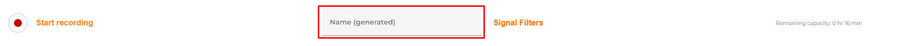
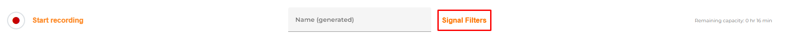
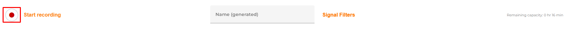

# Record Trace

 

* Choose a **name** for your Trace by clicking into the box below.
    * If you don't choose a name for the Trace, we will name it automatically.

* Next to it, you can choose a **signal filter**[^1].

* Hit the button to **start a recording**.

If you want to **stop** your recording, hit the button again and your finished Trace will **save** automatically.

----
[^1]:[The signal filter lets you decide, which device you want to create a Trace for. You can either choose a single device or even multiple at once as you like]().
