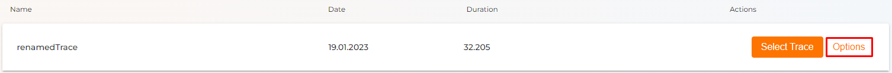
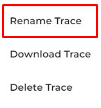
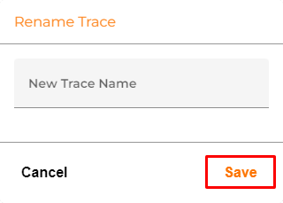

# Rename Trace

 

* Hit the **"Options"** button.

* Choose the **"Rename Trace"** option to rename your Trace.

* Type in your new Trace name and apply it by pressing the **"Save"** button.
    * Press **"Cancel"** if you don't want to rename your Trace.

Changing the name could help you to identify the Trace you needed from the other Traces.

----
