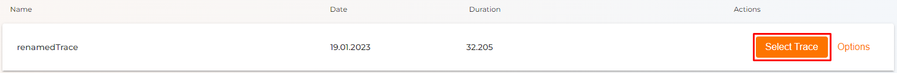
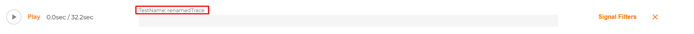
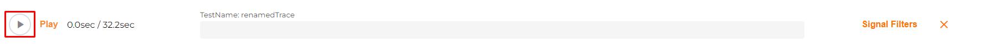

# Replay Trace

 

* Choose your Trace with the **"Select Trace"** button.

* The name of the selected Trace should appear at the progression bar.

* On the right you can choose the **"Signal Filter"**[^1].

* To replay your Trace hit the **"Play"** button.

Replaying your **Trace** gives you the opportunity to watch the actions of your device.

----

[^1]: [Choose the device which was recorded]().
