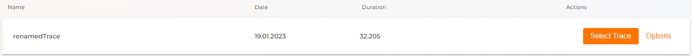
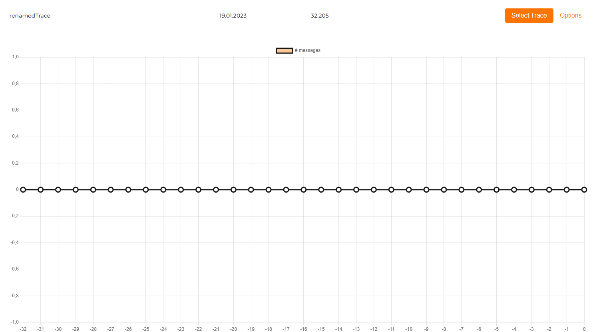

# View Trace

* Click on the **Trace bar**.

Now your **Trace** has a graphical visualization with your declared sampling rate.

In the headline you have your name of the Trace, the date the Trace was recorded, the duration and your main actions.

With this view you can now easily discern your Trace and get a better understanding of what's happenning.

----
